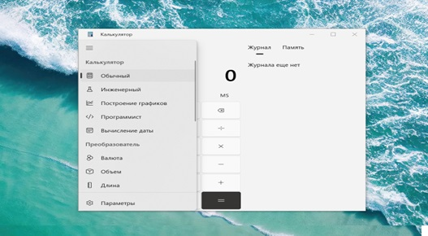
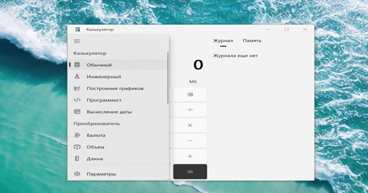

**Программное средство: Калькулятор на Windows 10**

**Общие сведения:**

Калькулятор (*calc.exe*) &mdash; программа Microsoft Windows, предназначенная
для выполнения несложных вычислительных операций: сложения, вычитания,
умножения и деления и т.д.

**Функциональное назначение**

Программа предоставляет пользователю удобный и простой интерфейс для
выполнения математических операций. Она предназначена для быстрого и
точного выполнения вычислений.

В Windows операционная система включает встроенную
программу-калькулятор.

**Основные функции:**

-   Встроенный калькулятор Windows предоставляет следующие функции:
	- сложение
	- вычитание
	- умножение
	- деление
	- вычисление процентов
	- округление чисел
	- извлечение квадратного корня.

-   Виды калькуляторов. Калькулятор в Windows включает в себя несколько
    видов калькуляторов: 
		- стандартный
		- научный
		- программистский
		- калькулятор с конвертерами для длины, веса, объема и других единиц
    измерения.

-   Доступность и использование. Калькулятор Windows доступен для
    использования напрямую из меню \"Пуск\" или поиска Windows. Он имеет
    простой и интуитивно понятный интерфейс для удобства пользователей.

-   В дополнение к базовым функциям, калькулятор Windows также
    предлагает функции инженерного калькулятора:
	- тригонометрические функции
	- логарифмы
	- факториалы
	- дробные дроби.

-   История вычислений. Калькулятор Windows также сохраняет историю
    выполненных вычислений, что обеспечивает возможность просмотра и
    повторного использования предыдущих операций.

**Описание логической структуры:**

Программа состоит из модулей для каждой математической операции
(сложение, вычитание, умножение, деление), а также интерфейсной части
для взаимодействия с пользователем.

**Используемые технические средства:**

Калькулятор работает на операционной системе Windows 10 или более
поздней версии.

**Вызов и загрузка:**

Программа вызывается путем двойного клика на ярлык программы на рабочем
столе или в меню \"Пуск\". Она загружается в оперативную память при
запуске.

**Входные данные:**

Пользователь вводит математические операции и числа, с которыми он хочет
произвести вычисления.

**Выходные данные:**

Программа выводит результат вычислений на экран, давая пользователю
необходимую информацию по результатам математических операций.

**Принцип работы:**

Чтобы начать работу, нажмите кнопку **Пуск** и выберите **Калькулятор**
в списке приложений.

Нажмите кнопку **Открыть навигацию** для переключения между режимами.
Используйте **стандартный** режим для базовой математики, **научный**
для расширенных вычислений, **программист** для двоичного кода,
**вычисление даты** для работы с датами и параметры в разделе
**Преобразователь** для преобразования единиц измерения.

Калькулятор может помочь [вычислять
даты](https://support.microsoft.com/help/4578254), [конвертировать
валюту](https://support.microsoft.com/help/4578260), а если вы
используете стандартный режим, вы можете сохранить окно калькулятора
поверх других окон(https://support.microsoft.com/help/4578261).

